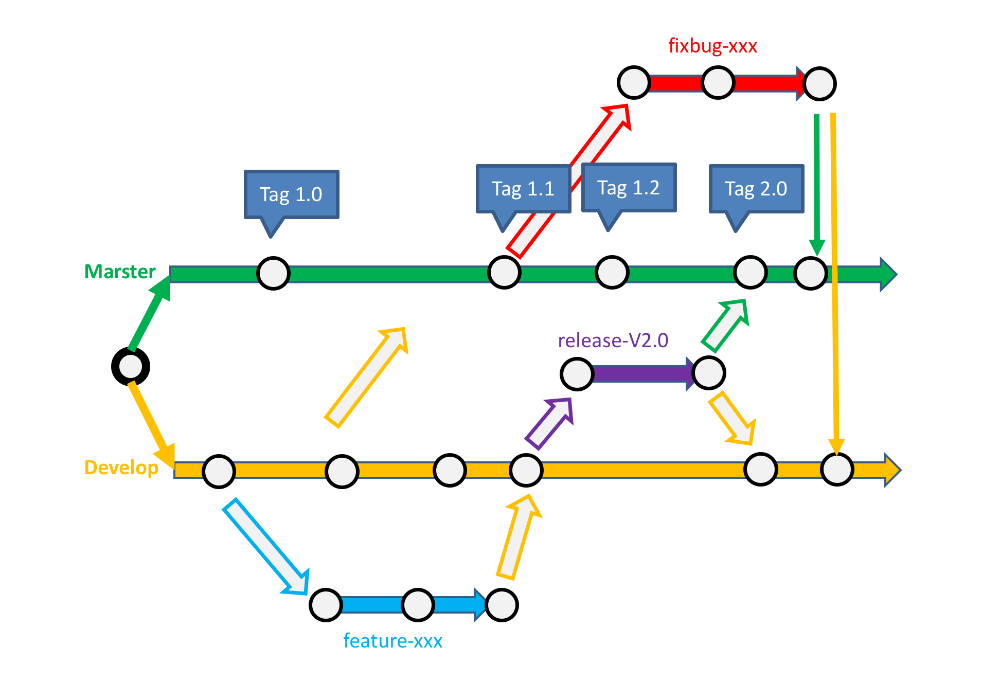

# TTT  is The TIS Tools

起源自TIS项目，对开发经验的积累！

--------

##	quick start

1. git clone https://github.com/shiyunlai/tistools.git

2. mvn eclipse:eclipse

3. mvn clean install

4. 导入，eclipse --> import... --> Existing Maven Porjects...

5. 运行服务提供者，eclipse定位到StartProviderDevmgr类，右键->Run as->Java Application

5. 启动 tools-web-tools  

	mvn tomcat7:run

5. 访问应用 http//localhost:8089/tis/tools/index.html  

5. 测试dubbo服务调用，直接在浏览器中输入http地址: http://localhost:8089/tis/tools/testController/calldubbo

--------

##	[基于github开发协作](./readme/基于Github开发协作.MD "开发管理")

--------

## 用到的技术

1. jdk1.8
1. 采用dubbox *[2.8.4a](https://github.com/yjmyzz/dubbox.git “”)*  
1. 采用 *zookeeper* 做注册中心  
1. 使用2.8.4a中的dubbo admin  
1. 使用tomcat6部署dubbo admin
1. 使用disconf进行配置管理
1. 基于maven工程管理
1. 基于git团队协作

## 应用架构

## 服务能力

&emsp;&emsp;[基础服务](./tools-service-abf/README.MD "Application Basic Framework")  
&emsp;&emsp;[开发管理](./tools-service-devmgr/README.MD "Develop Management")  
&emsp;&emsp;[日志分析](./tools-service-biztrace/README.MD "Business Log and Trace Analyze")  
&emsp;&emsp;[Maven插件](./tools-maven-plugin/README.MD "TTT的Maven扩展插件")  

## 服务清单

&emsp;&emsp;[前端需要的服务AC](./readme/前端需要的服务清单-AC.MD "前端需要的服务清单AC")  
&emsp;&emsp;[前端需要的服务OM](./readme/前端需要的服务清单-OM.MD "前端需要的服务清单OM")  

## 应用功能

&emsp;&emsp;[后管应用框架](./tools-web-tools/README.MD "应用基础框架，提供了OM、AC、SYS等基础管理能力")  
&emsp;&emsp;[手机端应用框架](... "提供一个手机端前端框架，对标‘指旺’")  

--------

##	开发说明

&emsp;&emsp;[如何在tools工程集中新增一个dubbo服务提供者XXX](./readme/新增一个服务提供者工程.MD "")

&emsp;&emsp;[如何在tools工程集中新增一个dubbo消费者工程XXX](./readme/新增一个服务消费者工程.MD "")

&emsp;&emsp;[如何发布Dubbo服务](./readme/开发并发布Dubbo服务.MD "")

&emsp;&emsp;[如何发布RESTFul服务](./readme/开发并发布RESTFul服务.MD "")

--------

##	开发规范

&emsp;&emsp;[工程命名规范](http://www.bronsp.com:8060/index.php?s=/5&page_id=106 "工程命名")

&emsp;&emsp;[package规范](http://www.bronsp.com:8060/index.php?s=/5&page_id=107 "package命名")

&emsp;&emsp;[使用maven扩展插件](./readme/使用Tools的Maven扩展插件.MD "maven扩展插件的使用")

&emsp;&emsp;[异常&错误码规范](./readme/异常和错误码.MD "异常和错误码")

&emsp;&emsp;[单元测试规范](./readme/如何进行单元测试.MD "单元测试")

&emsp;&emsp;[持续集成规范](./readme/如何进行持续集成.MD "持续集成")

--------

## [问题](./readme/问题收集.MD "关于问题")

--------

## 开发成员

	shiyunlai
	gaojie
	zhaochunhai

--------

## [TODO list](./readme/simple-plan.MD "工作计划")
