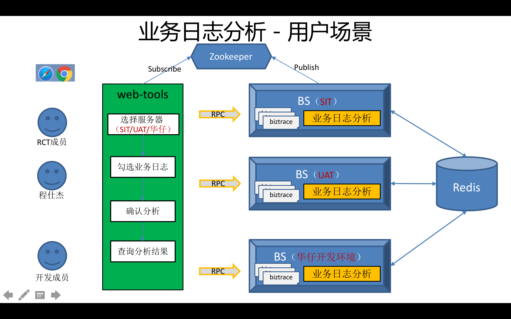
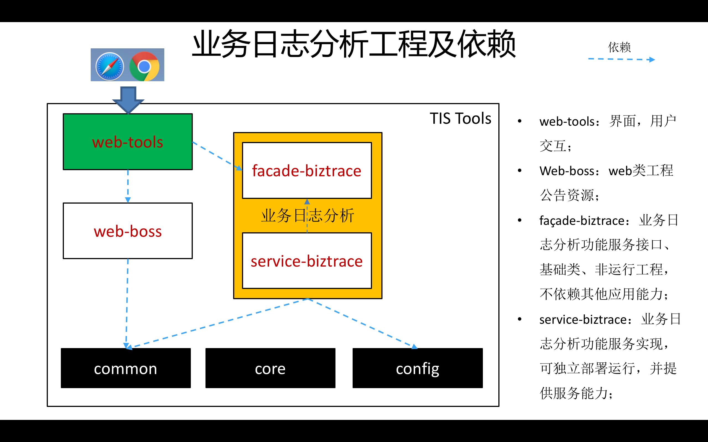
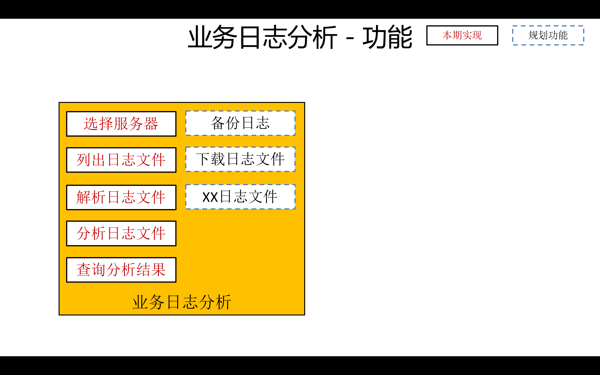

## 业务日志分析
	(biztrace log parse & analyse )
	
---
### 使用说明
	
	eclipse下启动
		执行 /tools-service-biztrace/src/test/java/org/tis/tools/service/biztrace/StartProviderBiztrace.java
	
	部署启动
		假如：bs安装路径为 ~/temp/bs
		
		cd ~/develop/tools # 定位到tools主工程路径
		mvn clean install -Dmaven.skip.test=true # 编译
		cd tools/service-biztrace/target
		cp tools-service-biztrace-0.0.1-assembly.tar ~/temp
		tar -zxvf tools-service-biztrace-0.0.1-assembly.tar 
		cd tools-service-biztrace/conf
		vi dubbo.properties # 根据情况设置 dubbo.protocol.port、dubbo.protocol.name
		vi redis.properties # 设置实际的reids地址
		cd ../bin
		./start.sh #启动日志代理服务
		./stop.sh #停止日志代理服务
		
		可通过Dubbo Admin查看当前有多少日志代理服务提供者
		tools-web-tools 启动后，会自动显示有那些日志代理服务，见：[tools-web-tools](../tools-web-tools/README.md)
	
	2016-12-20 完成disconf集成
	
		运行时如果没有diconf环境，可修改 /tools-service-biztrace/src/main/resources/disconf.properties 中
		disconf.enable.remote.conf=false
		使用本地配置启动
	
	
	
### 功能说明

#### 业务日志分析用户场景

#### 业务日志分析工程规划

#### 业务日志分析功能

### 开发过程

	集成disconf

### 一些问题

－－－－
	问题：dubbo服务启动后，无法自动注入RedisClientTemplate对象到LogFileParser.java中
	
	原因：不应该使用new进行对象的创建
	
	解决：增加SpringContextUtil，从而可以借助Spring的依赖注入进行对象的创建。
		见SpringContextUtil.getBean()

－－－－
	问题：集成disconf时，找不到disconf.properteis文件
	原因：没有放到正确的问题
	解决：src/main/resources/disconf.properties
	
－－－－
	问题：集成disconf时，报错
		
		2016-12-19 05:29:47,484 - com.baidu.disconf.client.watch.WatchFactory -8790 [main] ERROR  - cannot get watch module
java.lang.Exception: cannot get: RemoteUrl [url=/api/zoo/hosts, serverList=[127.0.0.1:7067], urls=[http://127.0.0.1:7067/api/zoo/hosts]]
	at com.baidu.disconf.core.common.restful.impl.RestfulMgrImpl.getJsonData(RestfulMgrImpl.java:75)
		...
		
		2016-12-19 05:29:47,694 - com.baidu.disconf.client.core.processor.impl.DisconfFileCoreProcessorImpl -9000 [main] DEBUG  - ==============	start to process disconf file: biztrace.properties	=============================
2016-12-19 05:31:17,032 - com.baidu.disconf.client.core.processor.impl.DisconfFileCoreProcessorImpl -98338 [main] ERROR  - java.lang.RuntimeException: HTTP GET Request Failed with Error code : 404
java.lang.RuntimeException: HTTP GET Request Failed with Error code : 404
	at com.baidu.disconf.core.common.restful.core.RestUtil.restGet(RestUtil.java:36)
	
	分析：
		在浏览器中直接输入 http://127.0.0.1:7067/api/zoo/hosts 报404
		跟着代码 RestfulMgrImpl 75行 查看url为： http://127.0.0.1:7067/api/web/config/list/configs?app=tools-service-biztrace&env=local&version=shiyl&key=biztrace.properties，在浏览器中直接输入改地址，报404
		
	原因：
		很明细了，是url不正确，
		因为tomcat中设置了应用路径为 disconf-web
		<Context path="/disconf-web" docBase="/Users/megapro/Soft/disconf/war"></Context>
		因此，请求地址 应该是 
		http://ip:port/disconf-web
		
		此处程序中调试时发现为 http://127.0.0.1:7067/api/zoo/hosts ，明细没有 disconf-web 
		但是又不能呢直接修改tomcat为
		<Context path="" docBase="/Users/megapro/Soft/disconf/war"></Context>
		否则disconf控制台将登陆不了（原因见 /disconf-base/war/html/assets/js/jquery-1.11.0.js 中8950行 url.url ="/disconf-web"+url.url;）
		
	解决：
		
		临时解决，修改 disconf.properties文件 
		disconf.conf_server_host=127.0.0.1:7067 
		为
		disconf.conf_server_host=127.0.0.1:7067/disconf-web
		
－－－－
	问题：解决了 404问题后，启动，报错
	2016-12-19 06:08:49,385 - com.baidu.disconf.client.core.processor.impl.DisconfFileCoreProcessorImpl -1894 [main] DEBUG  - ==============	start to process disconf file: mail.properteis	=============================
2016-12-19 06:08:49,390 - com.baidu.disconf.client.core.processor.impl.DisconfFileCoreProcessorImpl -1899 [main] ERROR  - java.lang.RuntimeException: 配置文件不存在
java.lang.RuntimeException: 配置文件不存在
	at com.baidu.disconf.client.core.processor.impl.DisconfFileCoreProcessorImpl.updateOneConfFile(DisconfFileCoreProcessorImpl.java:106)
	
	
	原因：
		mail.properties 文件内容为空
		
	解决：
		
		暂时解决，当前还不使用mail能力，因此删除mail.properteis
		
		最终解决，mail.properteis文件有值后，重新上传disconf-web
		
－－－－
	问题：
	原因：
	解决：
		
－－－－
	问题：
	原因：
	解决：
	
－－－－
	问题：
	原因：
	解决：

		
－－－－
	问题：
	原因：
	解决：